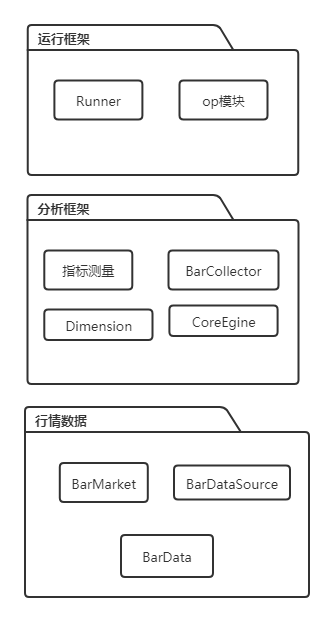
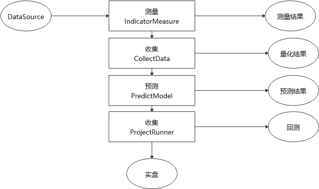

##Earnmi框架

整个框架分为3个部分:
+ 行情数据框
+ 分析框架
+ 运行框架

Context是所有框架的基础类，提供了运行环境等支持。
App就是一个Context对象。

### 行情数据

### 分析模块

#####总分分为5步
1. BarSource：准备行情数据
2. IndicatorMeasure:指标测量，判断指标情况
3. CollectData: 收集数据并量化数据
4. PredictModel:采用某个模型预测：
5. 建立一个OpPreject，去回测，并最终实盘操作。
### 运行框架

