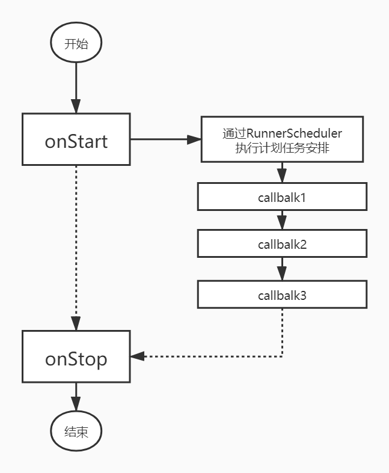

#实盘运行框架

###Runner生命周期


#####计划任务安排：
   通过Runner的RunnerScheduler对象，可以安排计划任务
* run_monthly: 每月执行
* run_weekly: 每周执行
* run_daily:每天执行。

#####定时操作与取消

```python
count = 0
def do_3_time():
    global count
    count+=1
    return count <3
job = context.post_timer(10,do_3_time)
```
定时每隔10s执行do_3_time()，只执行三次do_3_time函数，超过三次do_3_time()函数将返回False，表示取消定时操作。

另外一种方式是通过返回的job对象的cancel方法取消。
```python
job.cancel()
```


