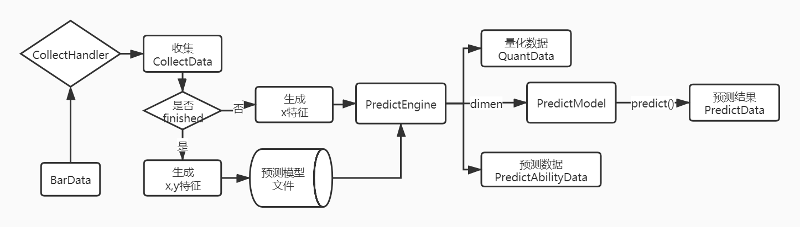

#预测分析处理



以上图解说明了如何从一个Bar一步一步分析到最终成为一个PredictData的，总得来说分以下几个步骤：
+   通过CollectorHander生成CollectData对象
+   对于finished的CollectData可以生成x,y特征做训练集合生成模型文件
+   对于unfinished的CollectData可以生成PredictData

###Dimension
所有预测、模型分析的基于某个维度的情况下，维度值相同说明了他们收集和预测的特征值是同一个范围内。通过维度值的调整从而达到预测的样本空间数据问题。

###CollectData:数据收集]

+ dimen: 某个维度，由于CollectData是众多行情市场的一个，
+ occurBars: 收集前的bars行情
+ predictBars: 收集后的需要预测bars行情
+ occurExtra: 收集前的额外数据
+ predictExtra：收集后的额外数据


###CoreEngine预测模型
#####生成预测模型

```python
_dirName = "..." ##模型存放路径
model = SKDJ_EngineModelV2()
historySource = ZZ500DataSource(start, middle)
engine = CoreEngine.create(_dirName, model, historySource, min_size=200, useSVM=False)
```

#####加载预测模型

```python
_dirName = "..." ##模型存放路径
model = SKDJ_EngineModelV2()
engine = CoreEngine.load(_dirName,model)
```

#####预测数据

```python
cData:CollectData = None
predict_model = engine.loadPredictModel(cData.dimen)
predict_data = predict_model.predict(cData)
```
###使用模型预测
