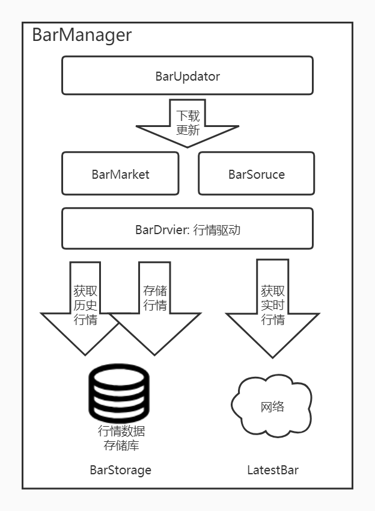
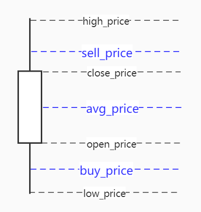

#行情
###行情框架


<span id="BarDataDriver"/>
###BarDriver
一个市场行情数据有几个部分组成，指数股（概念股），成分股。 而这些指数股和成分股的行情对应BarDrivier驱动引擎获取。

行情驱动:用来管理某一类股票池的行情数据的下载、存储、网络获取。
+   getCodes: 该驱动器所支持的股票代码池
+   fetchBarData：从网络上获取获取历史行情数据。
+   fetchLatestBar: 从网络上获取获取实时价格数据

行情数据分两种:
+ 历史行情数据:BarData、TickData, 该数据要先从网络下载到本地数据库BarStorage之后，再从数据库获取。
+ 实时行情数据:LatestBar，直接从网络获取。

通过BarDataDriver的，上面层market、BarDataSource就可以不需要关心缓存、存储、数据更新、线程安全问题去获取。

#####目前支持的驱动器
name|股票池|说明
--|--|--
StockIndexDriver|创业、上证、深证指数| 基础数据、判断交易日、是否开市的数据基础。
ZZ500StockDriver|中证500股票池|总共485个，日数据。
SW_DataDriver|申万二级股票池|开发中

<span id="BarData"/>
###BarData

行情的时间粒度分为：日、分钟、周、月行情

##### 基础数据:
    基础数据是BarData最原始的数据。
    + open_price  : 开盘价
    + high_price: 最高价
    + low_price: 最低价
    + close_price: 收盘价
    + volume: 成交量

##### 简单加工数据

######~~简单买卖价格sell_price、 buy_price~~
()
+   sell_price: 当时的卖方价格。
    卖方价格可以认为是超过当天收盘价的卖方力量与买房力量在看多方向的争夺价格
    sell_price = (high_price + close_price) / 2
+   buy_price : 当时的买方价格
    买房价格可以认为是超过当天收盘价的卖方力量与买房力量在看空方向上的争夺价格
    buy_price= (low_price + close_price) / 2
    


<span id="Market"/>
###行情Market与BarSource

#####market
一个市场行情数据有几个部分组成，指数股（概念股），成分股。 而这些指数股和成分股的行情对应BarDrivier驱动引擎获取。

所以构建一个行情时，要指定指数股驱动，成分股启动。


操作|方法|说明
--|--|--
历史行情数据|get_bars()|
实时行情数据|get_latest_bar()|
获取成分股列表|get_symbol_list()<br/>get_symbol_list_at()|对应BarDriver的get_sub_symbol_lists方法

#####BarSource
使用BarSoruce可以方便的遍历某个Driver的行情数据，可以选择串行显示，也可以选择并行显示。

方法名称|说明
---|---
get_bars()|获取某个时间段的行情数据
itemsSequence()| 串行方式去遍历行情数据
itemsParallel()| 并行方式去遍历行情数据

+ 例子:串行方式遍历中证500的行情数据
```python
app = App()
drvier2 = ZZ500StockDriver()
bar_source = app.getBarManager().createBarSoruce(drvier2)
for symbol,bars in bar_source.itemsSequence(Interval.DAILY):
    print(f"{symbol}: size = {len(bars)}")

```

+ 例子:并行方式遍历中证500的行情数据
```python
app = App()
drvier2 = ZZ500StockDriver()
bar_source = app.getBarManager().createBarSoruce(drvier2)
###按日期并行遍历bar数据
for day,bars in barSource.itemsParallel():
    print(f"day={day}: size= {len(bars)}")
```


<span id="donwnload"/>
###行情数据下载与调用
BarMarket: 行情市场对象，创建之前需要指定指数行情驱动，
BarUpdator： 行情数据更新器，负责下载更新最新市场行情数据，支持增量更新。
#####例子1: 创建一个中证500的行情市场对象。

```python
app = App()
index_driver = StockIndexDriver() ##A股指数驱动作为指数数据
drvier2 = ZZ500StockDriver()    ##中证500股票池驱动
market = app.bar_manager.createMarket(index_driver, [drvier2])
```
#####例子2: 下载最新市场行情数据

```python
app = App()
index_driver = StockIndexDriver() ##A股指数驱动
drvier2 = ZZ500StockDriver()    ##中证500股票池驱动
market = app.bar_manager.createMarket(index_driver, [drvier2])

bar_updator = app.bar_manager.createUpdator()
start_time = datetime(year=2020, month=12, day=20)
bar_updator.update(market, start_time)
```

<span id='barv2'/>

###BarV2：加工行情数据

    在做分析过程中，仅仅是开盘价、收盘价、最高价、最低价、成就量等等，不足以满足做分析。需要对原始数据做加工，然后附上Bar里头。比如一些指标值macd、rsi、kdj等。
    除了一些指标值，还有一些其它因子值。
    加工方式有：
+ 如果仅仅是对bar的简单加工不涉及其它因素，可以直接继承BarMarket的方式。参考类：BarV2Market
+ 如果数据加工比较复杂，需要涉及整体数据考虑，可以使用BarTransfrom框架加工。


##### 1）加工数据BarV2
    
BarV2表示二级加工数据，把分钟级别的数据加工成日级别的数据，并含有以下新数据。
######买卖价格sell_price、 buy_price

+   avg_price:平均价格，当天数据的平均价格。分钟级别的平均价格。avg_price是一个争夺价格，表示当天多空双方的妥协价格。
+   sell_price: 卖方价格：高于avg_price的平均价格
    卖方价格可以认为是超过当天收盘价的卖方力量与买房力量在看多方向的争夺价格，sell_price总是比avg_price高。可以认为看多时的期望的收盘价
+   buy_price : 卖方价格：低于avg_price收盘价的平均价格
    买方价格可以认为是超过当天收盘价的卖方力量与买房力量在看空方向上的争夺价格，buy_price总是比avg_price低，可以认为看空时的期望的收盘价
+   power_rate: 多空力量对比[-1,1]之间，多空对比 = [（avg_price- buy_price） - （sell_price - avg_price）] / （sell_price - buy_price)

###### 多空力量对比long_power、show_power、watch_power
+   long_power: 看多力量， 价格走势高于sell_price的成交量 / 总成交量
+   show_power: 看空力量， 价格走势低于buy_price的成交量 / 总成交量
+   watch_power:观望力量,  1 - long_power - short_power
    
可使用BarV2Market去获取加工数据BarV2

代码实例：使用BarV2Market获取V2数据
```python
app = App()
start = datetime(year=2020,month=1,day=24)
end = datetime(year=2021,month=2,day=5)
drvier = SW2Driver()
index_driver = StockIndexDriver()  ##A股指数驱动
market = app.getBarManager().createBarMarket(index_driver,[drvier])
v2_market = BarV2Market(market)
bars = v2_market.get_bars("801101",start,end)
```

##### 2）使用BarTransform加工bar

具体可以参看：因子生成。


<span id='trader'/>
###模拟买卖和测评

#####1、SimpleTrader 
  简单交易：统计每个交易的收益涨幅，持有天数，并输出测评结果
+ buy：买入
+ sell：卖出
+ watch：监听持有天数
+ print：打印测评结果

例子:
```Python
drvier1 = StockIndexDriver()
drvier2 = SW2Driver()
app = App()
start = datetime(year=2020,month=1,day=1)
end = datetime(year=2021,month=3,day=20)
bar_source = app.getBarManager().createBarSoruce(drvier2,start,end)
trader = SimpleTrader()
for day,bars in bar_source.itemsSequence():
    indicator = Indicator(40)
    print(f"start:{bars[0].symbol}")
    for bar in bars:
        indicator.update_bar(bar)
        if indicator.count < 34:
            continue
        dif, dea, macd_bar = indicator.macd(fast_period=12, slow_period=26, signal_period=9, array=True)
        ##金叉出现
        if (macd_bar[-1] >= 0 and macd_bar[-2] <= 0):
            if not trader.hasBuy(bar.symbol):
                the_buy_price = bar.close_price * 1.001  # 上一个交易日的收盘价作为买入价
                trader.buy(bar.symbol,the_buy_price,bar.datetime)
            ##死叉出现
        elif (macd_bar[-1] <= 0 and macd_bar[-2] >= 0):
            if trader.hasBuy(bar.symbol):
                sell_Price = bars[-1].close_price * 0.999  # 上一个交易日的收盘价作为买如价
                trader.sell(bar.symbol,sell_Price,bar.datetime)
        trader.watch(bar.datetime)
    trader.resetWatch()

trader.print()
```

输入结果：

    交易总数:519,平均涨幅:4.71, 平均持有天数:14.90
    涨幅分布情况:,[-15.00:-10.00)=29.09%,[10.00:15.00)=26.97%,[-10.00:-5.00)=15.22%,[-5.00:0.00)=11.75%,other=16.96%
    持有天数分布情况:,[1.00:7.33)=28.32%,[7.33:13.67)=25.82%,[20.00:26.33)=25.05%,[13.67:20.00)=17.34%,other=3.47% 


