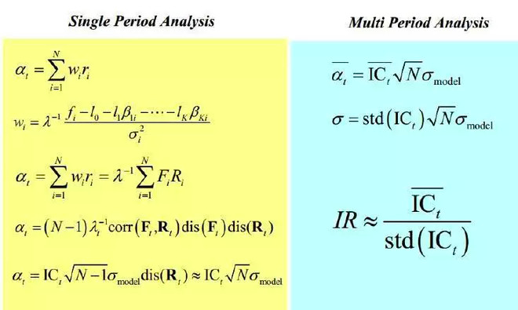

#因子IC、IR的介绍

IC即信息系数（Information Coefficient），表示所选股票的因子值与股票下期收益率的截面相关系数，通过 IC 值可以判断因子值对下期收益率的预测能力。信息系数的绝对值越大，该因子越有效。IC为负表示因子值越小越好，IC为正表示因子值越大越好。IC的计算方法是：计算全部股票在调仓周期期初排名和调仓周期期末收益排名的线性相关度（Correlation）。IC越大的因子，选股能力就越强。

IR即信息比率（Information Ratio），是超额收益的均值与标准差之比，可以根据 IC 近似计算，公式如下。该公式是从超额收益出发，逐步推导得出的。IR= IC的多周期均值/IC的标准方差，代表因子获取稳定Alpha的能力。整个回测时段由多个调仓周期组成，每一个周期都会计算出一个不同的IC值，IR等于多个调仓周期的IC均值除以这些IC的标准方差。所以IR兼顾了因子的选股能力（由IC代表）和因子选股能力的稳定性（由IC的标准方差的倒数代表）

IC最大值为1，表示该因子选股100%准确，对应的是排名分最高的股票，选出来的股票在下个调仓周期中，涨幅最大；相反，如果IC值为-1，则代表排名分最高的股票，在下个调仓周期中，跌幅最大，是一个完全反向的指标。

实际上，反向的指标也是非常有意义的。最无用的IC值是0或者接近0的值，这代表该因子对于股票没有任何的预测能力。当IC的绝对值大于0.05时，因子的选股能力较强，当IR大于0.5时因子稳定获取超额收益能力较强

#如何做因子研究

假设有个因子值f，该怎么去做研究呢。应该研究因子的目前状态。
###因子属性，过滤异常情况
count、mean、median（中位数),std、min、max，p-value、skew、var、kurtosis

##### 1、研究因子f的值分布，提取稳定态f_stable和异常态f_exception
+ 值分布范围，哪些范围是大概率（稳定态），哪些范围是小概率的（异常态）
+ 稳定态到异常态的变化信号，是什么？利空、市场情绪变化、还是压力累积的必然
可以分析，正常态与异常态的变换有没有规律，到异常态之后有没有研究的价值，是不是可以说明市场情绪变化太快，无法预测。

##### 2、研究因子值的单次变化fd的值分布，提取稳定态fd_stable和异常态fd_exception
+ 值分布范围，哪些范围是大概率（稳定态），哪些范围是小概率的（异常态）
+ 稳定态到异常态的变化信号，是什么？利空、市场情绪变化、还是压力累积的必然
可以分析，正常态与异常态的变换有没有规律，到异常态之后有没有研究的价值，是不是可以说明市场情绪变化太快，无法预测。
  
##### 3、研究因子f前n天的的方差fv(n)的值分布，提取稳定态fv(n)_stable和异常态fv(n)_exception
+ 值分布范围，哪些范围是大概率（稳定态），哪些范围是小概率的（异常态）
+ 稳定态到异常态的变化信号，是什么？利空、市场情绪变化、还是压力累积的必然
可以分析，正常态与异常态的变换有没有规律，到异常态之后有没有研究的价值，是不是可以说明市场情绪变化太快，无法预测。

这些因素的异常态累加起来是不是可以总结成一个异常波动值：哪些值范围说明正常突变现象，哪些值范围说明利好、利空现象，哪些值范围说明突发事件产生，被市场情绪所左右没有继续研究的价值。

一般来说，因子的fc和fv(n)处于稳定态的的时候是不是更具有研究价值。

+ 继续研究值的稳定态和突出态，是不是可以继续深挖：
    + 稳定态在什么情况下会大概率变成异常态，是否有规律
    + 预测异常态是一种怎么样的异常态，是走势突变呢还是什么也没变化，是利好突变还是利空，还是一种异常情况，完全由市场情绪主导，需要过滤。
    + 稳定态的持续时间跟异常态的持续时间
    + 通过这些异常值出现的总体频繁情况，是不是代表市场未来变化情况。

其实因子的每一次异常值的变化都说明市场的波动情况。

[因子数据的异常值处理和正态转换](https://zhuanlan.zhihu.com/p/26228474)
[p值与因子有效性分析](https://zhuanlan.zhihu.com/p/166087855)

### 因子数据处理

+ 标准化:
+ z-score 

###因子统计
+ 针对每期截面进行因子IC统计。
+ 汇总为时间序列上的IC数据，进行展示。

#因子研究整理

### BarV2分钟级别加工数据
    + 买卖价格：avg_price、sell_price、buy_price、power_rate
    + 多空力量对比：long_power、show_power、watch_power

[具体查看](../数据源.md#bar_v2_transfrom)
    
### 行业因子：
    + 盈利排名因子：win_factor, win_wave_factor
    + 成就量变化排名因子：volumn_changed_factor, volumn_changed_wave_factor

[具体查看](行业因子研究.md)

