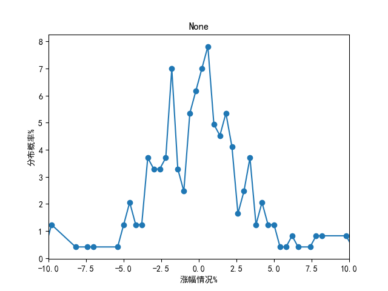
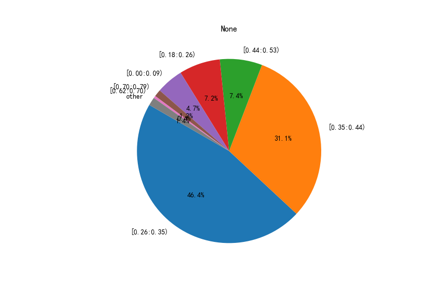

###涨幅分析

   在很多场景下，比如在某一维度下面的涨幅情况，需要对一系列的涨幅进行分析，通过查看涨幅的分布情况来决定预测是否有价值。
如果分布比较散乱的话，说明预测比较离散，没有预测价值，相反比较集中的则有预测价值，并且是大概率发生的。
   
###1、FloatRange(浮点熟区间范围)

+ encodeIndex: 将某个浮点值，编码到某一个区间值。
+ decodeIndex: 解码Index值，返回区间范围[lef,right)
注意，区间时左闭右开方式
###2、FloatDistribute:分布情况

根据FloatRange结合涨幅情况values,可以通过FloatDistribute查看并生成对应的情况。

+ 例子1:打印分布情况

```python
float_range = FloatRange(-10,10,20)  #生成浮点值范围区间对象
values = np.random.uniform(low=-10.0, high=10.0, size=100)  ##随机生成涨幅情况
dist = float_range.calculate_distribute(values)
print(f"dist:{dist.toStr()}")
```
    dist:[-5.00:-4.00)=9.00%,[-7.00:-6.00)=9.00%,[9.00:10.00)=8.00%,[8.00:9.00)=7.00%,other=67.00%
    
+ 例子2:显示分布饼图

```python
float_range = FloatRange(-10,10,20)  #生成浮点值范围区间对象
values = np.random.uniform(low=-10.0, high=10.0, size=100)  ##随机生成涨幅情况
dist = float_range.calculate_distribute(values)
dist.showPipeChat()
```


+ 例子3:显示曲线图

```python
float_range = FloatRange(-10,10,20)  #生成浮点值范围区间对象
values = np.random.uniform(low=-10.0, high=10.0, size=100)  ##随机生成涨幅情况
dist = float_range.calculate_distribute(values)
dist.showLineChat()
```


###3、FloatParser:分析

如何做涨幅分析：
    通过某个策略，找出分布情况偏向于于在某个区域。
+   找出集中分布在很小的一个区域范围内，范围越小越好而且偏离0%越大越好。
+   找出集中分布在两个很小的区域范围内，说明了买方力量和卖方力量
+   找出集中分布在三个很小的区域范围内，说明了买方力量和卖方力量和观望力量

######calc_avg_line
calc_avg_line就是计算中间分叉线（中间涨幅值），该分叉线把整个涨幅分布情况切成一半:
```python
values = np.random.uniform(low=-10, high=10, size=500)  ##随机生成涨幅情况
fPrarser = FloatParser()
print(f"calc_avg_line: {fPrarser.calc_avg_line(values)}")
```

######find_best_range

找出涨幅值中区间范围差值为delta_value(即right-legt = delta_value)的间最优的几个区间值。

    返回:
            [[区间(left,righ)平均值，分布值]....]
            即[[(left1+right1)/2, probal1][(left2+right2)/,proboal2]]
代码示例：
```python
values = np.random.uniform(low=-10.0, high=10.0, size=500)  ##随机生成涨幅情况
fPrarser = FloatParser(-10,10)   ##
result = fPrarser.find_best_range(values,2.0)
print(f"{result}")
```
打印结果：

    [[-8.059730110585566, 0.14200000000000002], [4.0245003784183675, 0.126], [-0.3151404049255868, 0.12200000000000003], [-3.7200893272416122, 0.12000000000000002], [8.898250796635423, 0.11600000000000002], [6.361230030988189, 0.10800000000000001], [-9.528531606486597, 0.036000000000000004]]

######calc_op_score

计算该涨幅情况具备可操作得分值。得分值越高越具备可操作性。具体时多少，需要跟整体情况比较才行。

那这个得分值时如何计算的，通过计算涨幅情况得分布，然后通过find_best_range计算出前3个最大的分布概率区间，去除涨幅最低的区间，剩余两个区间的涨幅值*分布值的绝对值相加就是最终的得分值。

代码: 计算中证500的各股涨幅情况得分值的概率分布图。    
```python
app = App()
start = datetime(year=2020,month=1,day=6)
end = datetime(year=2021,month=1,day=6)
drvier2 = ZZ500StockDriver()
bar_source = app.getBarManager().createBarSoruce([drvier2],Interval.DAILY,start,end)
score_list = []
bars,symbol = bar_source.nextBars()
while not bars is None:
    rate_list = []  ##该个股的涨跌幅列表
    pre_bar = None
    for bar in bars:
        if BarUtils.isOpen(bar):
            if not pre_bar is None:
                _rate = (bar.close_price - pre_bar.close_price )* 100  / pre_bar.close_price
                rate_list.append(_rate)
            pre_bar = bar
    fParser = FloatParser()  ##设置最大涨跌幅度
    score = fParser.calc_op_score(rate_list,1.6)
    print(f"{symbol}: size = {len(rate_list)},score:{score}")
    score_list.append(score)
    bars, symbol = bar_source.nextBars()
fDist = FloatDistribute(score_list)
fDist.showPipChart(limit_show_count=8)
```
最终饼图:



###验证calc_op_score
calc_op_score得分值高低说明某一种维度的涨幅分析时具有某一个倾向性，其代表了是一种趋向于非0%得能力，得分值越高，总体趋势越偏离0%得涨幅，说明具有量化分析得价值，可考虑引入某个策略去做多或者做空。


#####验证方法一:
遍历所有中证500个股3日k线形态，计算calc_op_score得分值最高得10个3日k线形态


###其它
策略一、
比如识别某个走势形态，然后集中分析相同形态（同一维度）下所有的分布情况，找出最优最大概率的分布范围。在这个基础上，
然后再与机器学习去辅助最终预测。

算法一:
通过一系列涨幅分析，计算一个可操作值，值越偏离0越好，为正说明适合做多，为负说明适合做空。

算法二：
通过一系列涨幅分析，计算做多和做空可操作值，两者之间的振幅越越大，说明多空分歧大。


