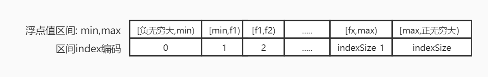
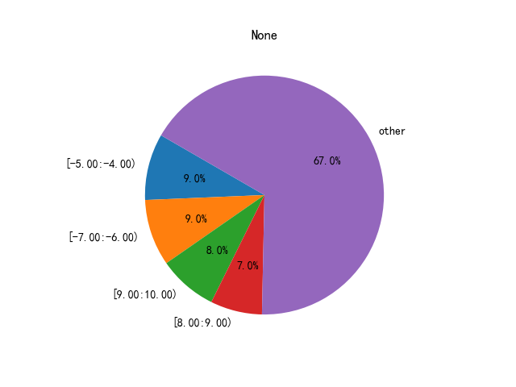

###涨幅分析

   在很多场景下，比如在某一维度下面的涨幅情况，需要对一系列的涨幅进行分析，通过查看涨幅的分布情况来决定预测是否有价值。
如果分布比较散乱的话，说明预测比较离散，没有预测价值，相反比较集中的则有预测价值，并且是大概率发生的。
   
###1、FloatRange(浮点熟区间范围)

+ encodeIndex: 将某个浮点值，编码到某一个区间值。
+ decodeIndex: 解码Index值，返回区间范围[lef,right)
注意，区间时左闭右开方式
###2、FloatDistribute:分布情况

根据FloatRange结合涨幅情况values,可以通过FloatDistribute查看并生成对应的情况。

+ 例子1:打印分布情况

```python
float_range = FloatRange(-10,10,20)  #生成浮点值范围区间对象
values = np.random.uniform(low=-10.0, high=10.0, size=100)  ##随机生成涨幅情况
dist = float_range.calculate_distribute(values)
print(f"dist:{dist.toStr()}")
```
    dist:[-5.00:-4.00)=9.00%,[-7.00:-6.00)=9.00%,[9.00:10.00)=8.00%,[8.00:9.00)=7.00%,other=67.00%
    
+ 例子2:显示分布饼图

```python
float_range = FloatRange(-10,10,20)  #生成浮点值范围区间对象
values = np.random.uniform(low=-10.0, high=10.0, size=100)  ##随机生成涨幅情况
dist = float_range.calculate_distribute(values)
dist.showChat()
```


###3、FloatParser:分析

如何做涨幅分析：
    通过某个策略，找出分布情况偏向于于在某个区域。
+   找出集中分布在很小的一个区域范围内，范围越小越好而且偏离0%越大越好。
+   找出集中分布在两个很小的区域范围内，说明了买方力量和卖方力量
+   找出集中分布在三个很小的区域范围内，说明了买方力量和卖方力量和观望力量

策略一、
比如识别某个走势形态，然后集中分析相同形态（同一维度）下所有的分布情况，找出最优最大概率的分布范围。在这个基础上，
然后再与机器学习去辅助最终预测。

算法一:
通过一系列涨幅分析，计算一个可操作值，值越偏离0越好，为正说明适合做多，为负说明适合做空。

算法二：
通过一系列涨幅分析，计算做多和做空可操作值，两者之间的振幅越越大，说明多空分歧大。


