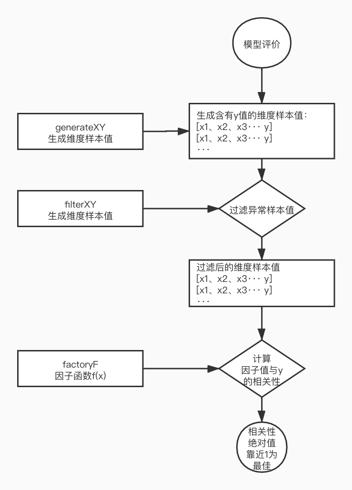

# 概要

策略模型只考虑某个想法是否有可操作性，是否能够脱胎于普通大众的情况，具体怎么交易怎么回测，不在这里讨论范畴。

这里的策略模型只是初步分析这种模型是否有效，在考虑有效的情况下才考虑怎么样的一个交易策略。具体看：[回测和实盘框架](earnmi_docs/book/回测和实盘框架.md)


<span id='simple_strategy'/>

#简单策略：BuyOrSellStrategy

所有的策略类在：BarStrategy.py


##### 说明
属于单个股票操作类，单个股票的买入卖出策略类。 计算买入点和卖出点的 。
缺点：
+ 可能持有周期太长，没有止损点操作，对于买入点产出之后的中途走势异样没有修正。
+ 卖出点没有细分：止损点和止盈点，比较粗糙。

##### 回测函数 analysis_BuyOrSellStrategy()
  可以通过该函数运行策略测评结果，该测评函数会把策略按正方向（买入点作为实际买点）和负方向（卖出入点作为实际买点）分布执行一遍。执行得出以下数据指标：

+ 交易数： 数量超过100个才有意义
+ 均收益： 每个操作的平均收益, 正常来说：正收益和负收益应该是相反的
+ 均天数： 每个操作的平均持有天数
+ 正向收益分布：
+ 反向收益分布：  
+ 反向值：  反向操作的值，一般来说，策略的正向操作与反向操作的收益分布应该是相反的才对，如果不相反说明没有该策略的没有任何操作意义。具体的：1以下是及格的，越接近0越好。

有价值的策略应该是正向和反向操作是相反性质的，如果没有相反性质说明该策略没有价值。

##### 反向值的研究

  有个简单策略：买入的点就是macd的金叉，卖出点就是macd的死叉，得出来的数据是：

```
交易总数:519, 平均涨幅:4.92, 平均持有天数:15.90
收益分布情况:,[-MAX:-1.00)=52.22%,[1.00:MAX)=42.97%,[-1.00:1.00)=4.82%
```
  
  按道理来说，如果这个策略反过来操作，即：买入的点就是macd的死叉，卖出点就是macd的金叉。那应该收益率是反过来的，但实际结果是：

```
交易总数:517, 平均涨幅:6.53, 平均持有天数:16.35
收益分布情况:,[1.00:MAX)=48.16%,[-MAX:-1.00)=47.39%,[-1.00:1.00)=4.45%
```


相关的策略评测可以参考：
+ [申万二级行业策略分析](案例/申万二级行业策略分析.md)

### 运行框架
  只是作为一个分析框架，没必要作为实盘运行，暂不讨论和支持。

### 复杂策略策略。

属于单个股票操作类，考虑分钟K线，会考虑买入点、止盈点、止孙点、观望状态等等。


<span id='factory_strategy'/>

#多维度因子策略模型

### 基本概念
+ 维度样本生成策略： generateXY
+ 维度样本异常数据过滤策略: filterXY
+ 因子函数值策略:  factoryF

维度样本策略：
根据行情数据，生成各个维度的样本
x1、x2、x3、x4···  y
x： 为维度因子值
y:  为盈利结果，可以是m天后的最大涨幅或者m天的涨幅。

#####样本异常数据
+ 一个影响策略模型数据的就是一些异常数据，比如异常的维度值、或者异常的y值，所以在测评的时候需要注意去掉这些样本的数据。
+ 比如：停盘、白天鹅暴涨、黑天鹅暴跌


### 1、策略模型评价
  如何评价一个策略模型是有效的呢，即怎么保证：generateXY、filterXY、factoryF 三个策略是有效的呢，如下图：



其实很简单，就是看IC和IR值，具体步骤如下：
1、根据维度值x和因子函数值f，
2、计算每个纬度值对应的因子值f[]
3、计算f[]于y值的[]的相关性IC，如果相关性越靠近1或-1，说明这种多维度因子模型是有效的。


#### 交易运行框架
  
  支持操作单和实盘运行框架进行回测和实盘运行，有待补充。


