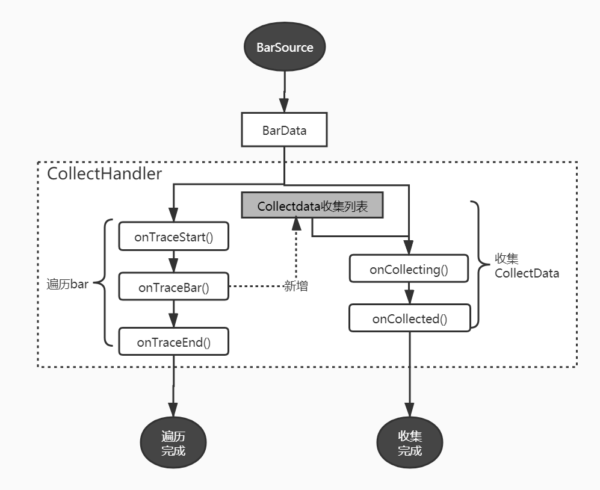

#行情收集

<span id ='collect_data'/>

###CollectData

+ dimen_value: 维度值
+ occurs_bars: 已知的bars行情
+ unkonw_bars:  未知情况的bar值，需要预测和分析的
+ extra: 额外数据
+ isFinished(): 是否完成状态，返回true时表示unkonw_bars已经收集完整
+ isValid(): 是否有效状态，在onCollecting时，通过更改这个有效状态来过滤最终结果。无效的状态将会不会在onCollected回调处理。


###CollectHandler收集器

#####收集过程图


#####代码示例:

实现CollectHandler:

```python
class Pattern_2k_by_algo1_handler(CollectHandler):
    def __init__(self):
        self.pattern_values = [206671, 265649, 213961, 265639, 265720, 206580, 324769, 81283, 265629, 29443, 206590,
                                 206337, 199381, 265619, 259159, 265963, 265376,
                                 442867, 14944, 265710, 258430, 265719, 280300, 206428, 265801, 265467, 81040, 36814,
                                 21991, 251140, 265477, 88330, 88492, 95863, 265497, 265740, 265711,
                                 265487, 88482, 199138, 199300, 265638, 88320, 206347, 88573, 22234, 206681, 258420,
                                 279571, 265730, 273010, 266449, 205942, 265386, 265721, 272281, 265729, 265406,
                                 273020, 192091, 265457, 273000, 251869, 88563, 258187, 103153, 221251, 258440, 73993,
                                 264991, 258349, 265700, 265659, 272919, 272929]

    def onTraceStart(self, symbol: str):
        self.bar_list = []
        print(f"onTraceStart:{symbol}")
        pass

    def onTraceBar(self, bar: BarData):
        if not BarUtils.isOpen(bar):
            self.bar_list = []
            return None
        self.bar_list.append(bar)
        pattern_vaule = KPattern.encode_2k_by_algo1(self.bar_list)
        if self.pattern_values.__contains__(pattern_vaule):
            ##产生一个收集数据
            return CollectData(dimen_value=pattern_vaule,occur_bars=self.bar_list[-3:])
        return None

    def onCollecting(self, data: CollectData, bar: BarData):
        data.unkown_bars.append(bar)
        cur_size = len(data.unkown_bars)
        if cur_size>= 14:
            data.setFinished() ##收集到有14天的数据就算收集完成。
```

收集:

```python
app = App()
start = datetime(year=2018,month=1,day=6)
end = datetime(year=2021,month=1,day=6)
drvier2 = ZZ500StockDriver()
bar_source = app.getBarManager().createBarSoruce([drvier2], Interval.DAILY, start, end)
finished_list = []
CollectHandler.visit(Pattern_2k_by_algo1_handler(),bar_source,finished_list=finished_list)
```

