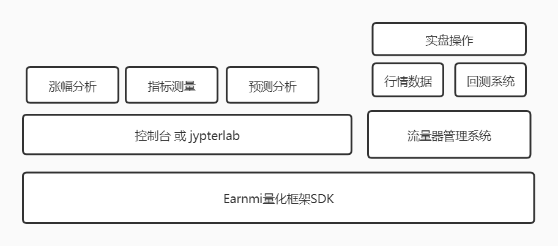

###计划与想法

###### 一、earnmi 开源项目

做成一个earnmi 开源项目,提供一个专为股票系统做会测的开源项目。 
目标是：轻代码(地代码)、行情数据、分析框架、快速部署网络。

盈利方式： 卖行情数据接口、二次开发、收费知识;

###### 二、earnmi的框架下面做自己的量化分析和策略

###问题汇总

+ 下载分钟级别的数据库太大，比如：申万二级分钟数据，1年的数据超过1G以上。

